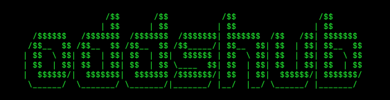

<h3 align="center">
  <br />
  
  <br />
  <br />
  <br />
</h3>

# oddshub 

>  A terminal UI for sports betting programmers.

[](https://raw.githubusercontent.com/dos-2/oddshub/main/LICENSE)
[](https://goreportcard.com/report/github.com/dos-2/oddshub)
[](#contributing)

[`oddshub`](https://github.com/dos-2/oddshub) is a terminal UI is designed to swiftly and efficiently display sports betting odds, featuring a polished interface with aesthetic appeal.

This app is inspired by [`htop`](https://en.wikipedia.org/wiki/Htop) and [`cointop`](https://github.com/cointop-sh/cointop).


Desktop aesthetic


## Installation
Make sure to have [`go`](https://go.dev) (1.17+) installed, then do:

```go install github.com/dos-2/oddshub@latest```

The cointop executable will be under your GOPATH so make sure $GOPATH/bin is added to the $PATH variable if not already.

Now you can run oddshub:

```oddshub```

windows reference: https://stackoverflow.com/questions/44272416/how-to-add-a-folder-to-path-environment-variable-in-windows-10-with-screensho

macos reference: https://www.cyberciti.biz/faq/appleosx-bash-unix-change-set-path-environment-variable/

## Features

- **Odds Display**: Displays moneyline, spreads, totals, and outrights for detailed betting insights.
- **Team Colors**: Custom color coding for each team or outcome, enhancing visual clarity.
- **Mouse Support**: Enables intuitive navigation and interaction within the terminal interface.
- **API Integration**: Utilizes [`the odds-api`](https://the-odds-api.com) to fetch daily updates for sports odds.

## Supported Sports and Leagues

### Football
- **NFL**
- **NCAA**

### Basketball
- **NBA**
- **NCAA**

### Baseball
- **MLB**
- **NCAA**

### Soccer
- **MLS**
- **Copa America**
- **UEFA Euro Championship**
- **UEFA Champions League**
- **Brazil Campeonato**
- **Premier League**
- **La Liga**

### Hockey
- **NHL**

### Golf
- **PGA Tournament**
- **Masters Tournament**

### Tennis
- **Mens & Womens Wimbledon**
- **Mens & Womens French Open**

### Mixed Martial Arts
- **All major leagues supported**

### Boxing
- **All major leagues supported** 

### Cricket
- **IPL**

## Contributing

For contributions simply fork, create a new branch, and submit for a PR review.

## Social

*soon*

## License

Released under the [Apache 2.0](./LICENSE) license.

© [dos](https://github.com/dos-2)